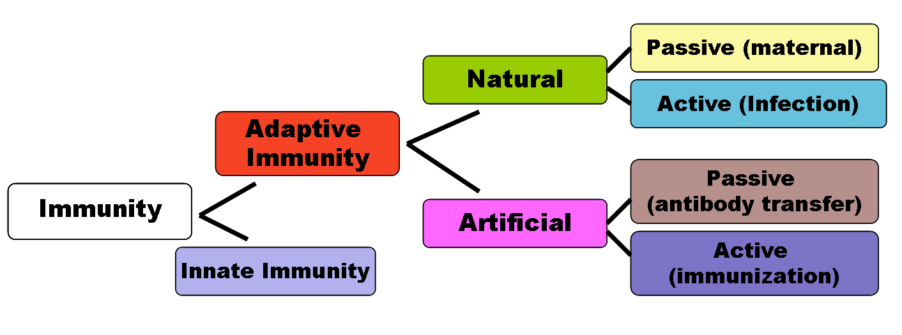

# STA426Test
## Fundamentals of Immunology

Immunity is the capability of [multicellular organisms](https://en.wikipedia.org/wiki/Multicellular_organism) to resist harmful [microorganisms](https://en.wikipedia.org/wiki/Microorganism) from entering it. Immunity involves both specific and nonspecific components. The nonspecific components act as barriers or eliminators of a wide range of pathogens irrespective of their antigenic make-up. Other components of the [immune system](https://en.wikipedia.org/wiki/Immune_system) adapt themselves to each new disease encountered and can generate pathogen-specific immunity.

An immune system may contain [innate](https://en.wikipedia.org/wiki/Innate_immune_system) and [adaptive](https://en.wikipedia.org/wiki/Adaptive_immune_system) components. The innate system in mammalians, for example, is composed of primitive [bone marrow](https://en.wikipedia.org/wiki/Bone_marrow) cells that are programmed to recognise foreign substances and react. The adaptive system is composed of more advanced [lymphatic](https://en.wikipedia.org/wiki/Lymphocyte) cells that are programmed to recognise self-substances and don't react. The reaction to foreign substances is etymologically described as [inflammation](https://en.wikipedia.org/wiki/Inflammation), meaning to set on fire. The non-reaction to self-substances is described as immunity, meaning to exempt or as immunotolerance. These two components of the immune system create a dynamic biological environment where "health" can be seen as a physical state where the self is immunologically spared, and what is foreign is inflammatorily and immunologically eliminated. "_Disease_" can arise when what is foreign cannot be eliminated or what is self is not spared.

Innate immunity, also called native immunity, exists by virtue of an organisms constitution, that is its genetic make-up, without an external stimulation or a previous infection. It is divided into two types: 
* (a) Non-Specific innate immunity, a degree of resistance to all infections in general. 
* (b) Specific innate immunity, a resistance to a particular kind of microorganism only. As a result, some races, particular individuals or breeds in agriculture do not suffer from certain infectious diseases.

Adaptive immunity can be sub-divided depending on how the immunity was introduced in 'naturally acquired' through chance contact with a disease-causing agent, whereas 'artificially acquired immunity' develops through [deliberate actions](https://en.wikipedia.org/wiki/Artificial_induction_of_immunity) such as vaccination. Both naturally and artificially acquired immunity can be further subdivided depending on whether the host built up immunity itself by antigen as '_active immunity_' and lasts long-term, sometimes lifelong. '_[Passive immunity][passive]_' is acquired through transfer (injection or infusion) of antibodies or activated T-cells from an immune host; it is short lived—usually lasting only a few months. The diagram below summarizes these divisions of immunity.

Adaptive immunity can also be divided by the type of immune mediators involved; [humoral immunity](https://en.wikipedia.org/wiki/Humoral_immunity) is the aspect of immunity that is mediated by secreted antibodies, whereas cell mediated immunity involves T-lymphocytes alone. Humoral immunity is called active when the organism generates its antibodies, and passive when antibodies are transferred between individuals or species. Similarly, [cell-mediated immunity](https://en.wikipedia.org/wiki/Cell-mediated_immunity) is active when the organisms’ T-cells are stimulated, and passive when T cells come from another organism.

## [Passive Immunity][passive]

### **Naturally acquired passive immunity**

Maternal passive immunity is a type of naturally acquired passive immunity, and refers to antibody-mediated immunity conveyed to a fetus by its mother during pregnancy. Maternal antibodies (MatAb) are passed through the placenta to the fetus by an FcRn receptor on placental cells. This occurs around the third month of gestation. IgG is the only antibody isotype that can pass through the placenta. Passive immunity is also provided through the transfer of IgA antibodies found in breast milk that are transferred to the gut of the infant, protecting against bacterial infections, until the newborn can synthesize its antibodies. Colostrum present in mothers milk is an example of passive immunity.

### **Artificially acquired passive immunity**

Artificially acquired passive immunity is a short-term immunization induced by the transfer of antibodies, which can be administered in several forms; as human or animal blood plasma, as pooled human immunoglobulin for intravenous (IVIG) or intramuscular (IG) use, and in the form of monoclonal antibodies (MAb). Passive transfer is used prophylactically in the case of immunodeficiency diseases, such as hypogammaglobulinemia. It is also used in the treatment of several types of acute infection, and to treat poisoning. Immunity derived from passive immunization lasts for only a short period of time, and there is also a potential risk for hypersensitivity reactions, and serum sickness, especially from gamma globulin of non-human origin.

The artificial induction of passive immunity has been used for over a century to treat infectious disease, and before the advent of antibiotics, was often the only specific treatment for certain infections. Immunoglobulin therapy continued to be a first line therapy in the treatment of severe respiratory diseases until the 1930s, even after sulfonamide lot antibiotics were introduced.

### **Transfer of activated T-cells**

Passive or "adoptive transfer" of cell-mediated immunity, is conferred by the transfer of "sensitized" or activated T-cells from one individual into another. It is rarely used in humans because it requires histocompatible (matched) donors, which are often difficult to find. In unmatched donors this type of transfer carries severe risks of graft versus host disease. It has, however, been used to treat certain diseases including some types of cancer and immunodeficiency. This type of transfer differs from a bone marrow transplant, in which (undifferentiated) hematopoietic stem cells are transferred.

[passive]: https://en.wikipedia.org/wiki/Passive_immunity
## Active Immunity

### **Naturally acquired active immunity**
Further information: Immune system
Naturally acquired active immunity occurs when a person is exposed to a live pathogen and develops a primary immune response, which leads to immunological memory. This type of immunity is "natural" because deliberate exposure does not induce it. Many disorders of immune system function can affect the formation of active immunity such as immunodeficiency (both acquired and congenital forms) and immunosuppression.

### **Artificially acquired active immunity** 

It can be induced by a vaccine, a substance that contains antigen. A vaccine stimulates a primary response against the antigen without causing symptoms of the disease. Richard Dunning coined the term vaccination, a colleague of Edward Jenner, and adapted by Louis Pasteur for his pioneering work in vaccination.

There are four types of traditional vaccines:

* Inactivated vaccines are composed of micro-organisms that have been killed with chemicals and/or heat and are no longer infectious. Examples are vaccines against flu, cholera, plague, and hepatitis A. Most vaccines of this type are likely to require booster shots.
* Live, attenuated vaccines are composed of micro-organisms that have been cultivated under conditions which disable their ability to induce disease. These responses are more durable and do not generally require booster shots. Examples include yellow fever, measles, rubella, and mumps.
* Toxoids are inactivated toxic compounds from micro-organisms in cases where these (rather than the micro-organism itself) cause illness, used prior to an encounter with the toxin of the micro-organism. Examples of toxoid-based vaccines include tetanus and diphtheria.
* Subunit vaccines are composed of small fragments of disease-causing organisms. A characteristic example is the subunit vaccine against Hepatitis B virus.
